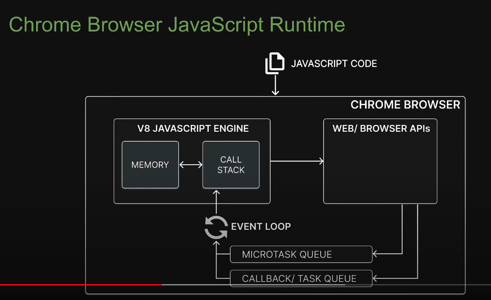

# Node JS Fundamentals Concepts

## What Node JS is?

### Going Back in time

- 1993, the first web browser with a user interface called Mosaic was released.
- 1994, lead developers of Mosaic founded a company called Netscape, then they released
        a more polished web browser called Netscape Navigator.

        Web pages could only be static, so there was not interactivity after a page
        was loaded.
- 1995, Netscape created a new Scripting Language called JavaScript.
- 1995, Microsoft debuted their Microsoft Internet Explorer web browser.

        Also Microsoft realised that JavaScript fundamentally changed the user experience 
        of the web and wanted the same for the new Internet Explorer.

        But at that time, there was no specification for them to follow.
- 1996, Microsft reverse-engineered the Netscape Navigator to create its own 
        scripting language called JScript.
- Nov 1996, Netscape submitted JavaScript to ECMA International.
- 1997, ECMA Script 1
- 1998, ECMA Script 2
- 1999, ECMA Script 3
- 2000, ECMA Script 4 never was released
- 2009, ECMA Script 5
- 2015, ECMA Script 2015 ( ES6 )

**One version every year is released since 2015**

### 1. Google Chrome JavaScript Runtime Environment

What do we mean by a Runtime Environemt, is all components needed to run or execute
JavaScript program. This time around we are taking about Runtime Environment into a 
Google Chrome Browser, also know as V8 Engine.  

V8 as designed by Google in 2008, enabling JavaScript programs to runs outside a browser
so now we are able to execute JS programs by using a JRE knows as Node JS, 
which we can use to build backend services like API, based on terminal or CLI programs and more.

**Image 1. Graphical representatio about the Google Chrome JRE** 

- JavaScript Runtime Environment

- V8 Engine

- Node Modules
